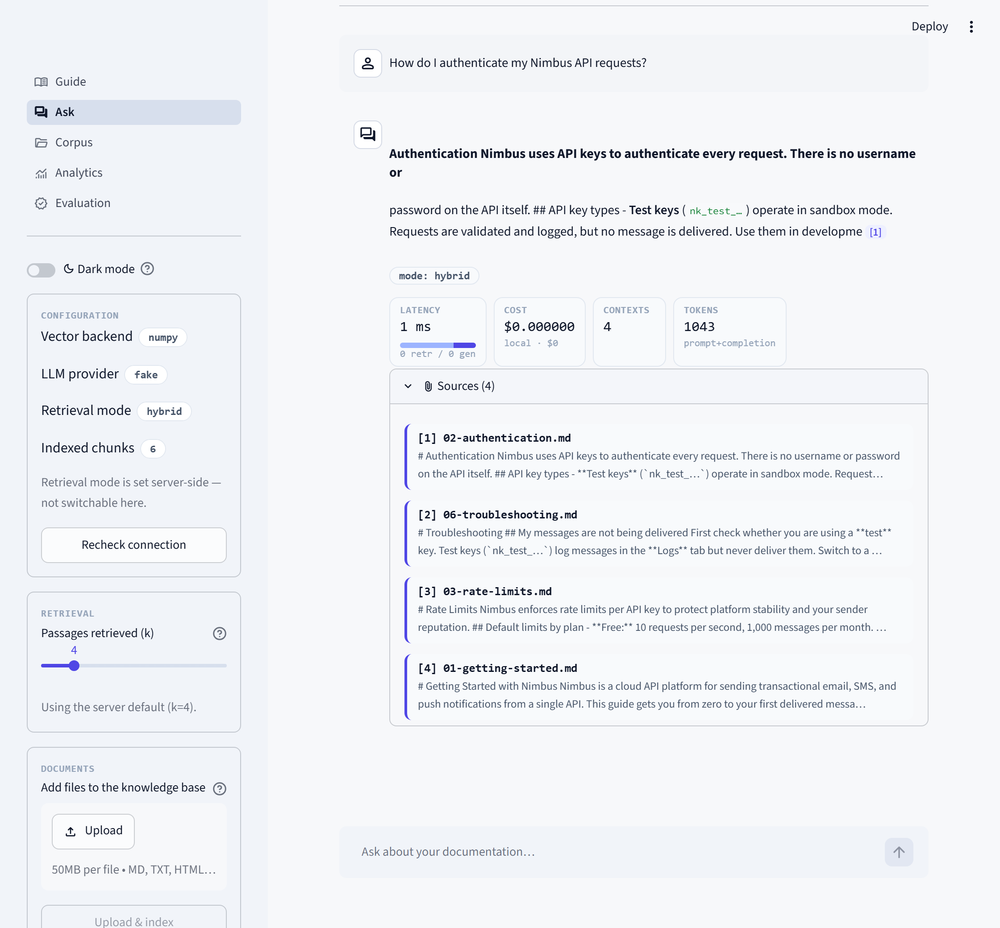
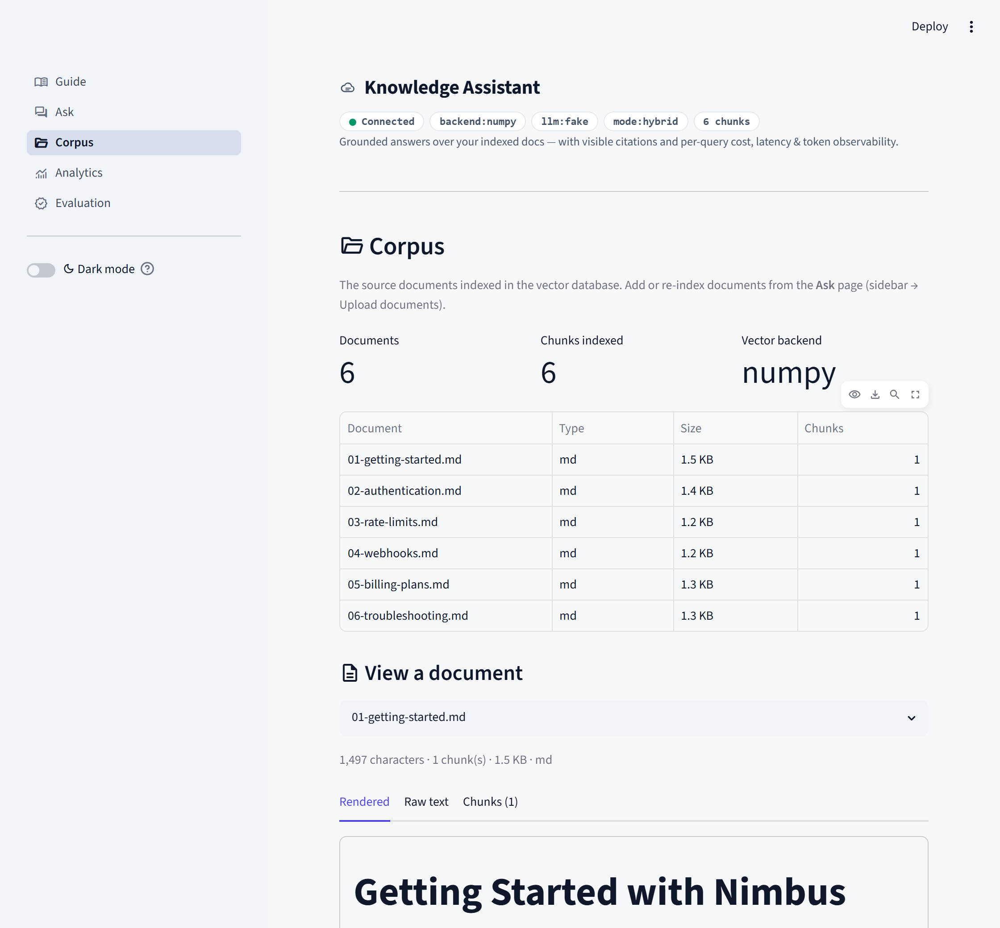
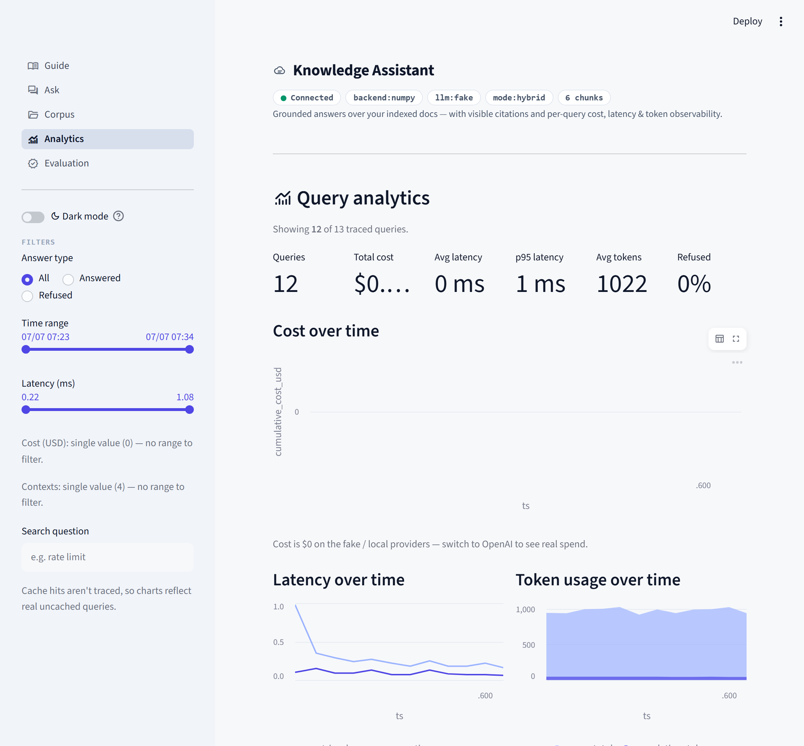
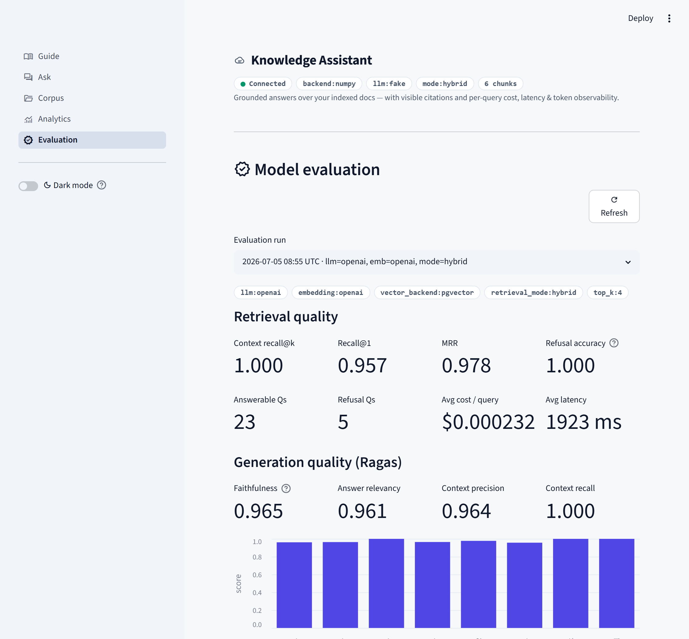
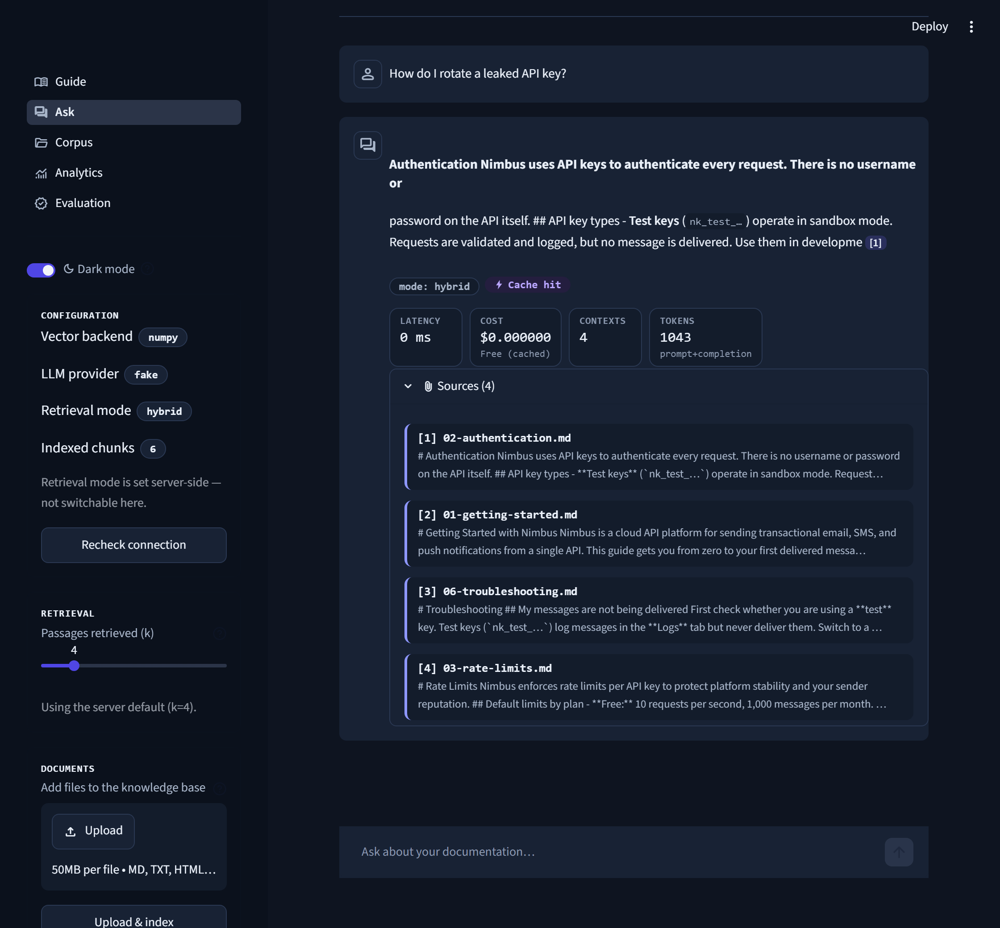
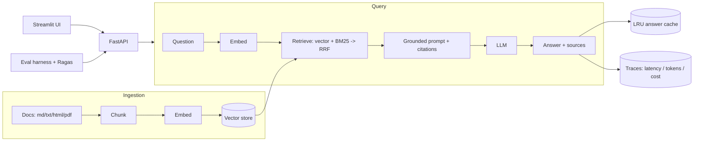

# RAG Knowledge Assistant

> A production-style **Retrieval-Augmented Generation** service that answers questions over a document corpus with **grounded, cited answers**, **hybrid retrieval**, a **built-in evaluation pipeline**, and **cost / latency observability**.

**▶ [Try the live demo](https://rag-knowledge-assistant-baron-p-hartono.streamlit.app/)** — grounded, cited answers right in your browser · keyless `fake` mode · no signup.

[](https://rag-knowledge-assistant-baron-p-hartono.streamlit.app/)
[](https://github.com/Baron197/rag-knowledge-assistant/actions/workflows/ci.yml)


-8A2BE2)


This is not a notebook demo. It is the part of RAG that is actually hard in
production: knowing whether the answers are correct, what they cost, and being
able to change the system without breaking it. Those concerns — grounding,
hybrid retrieval, evaluation, observability, and clean swappable components — are
first-class here.

> **Try it in 2 minutes with no API key.** A keyless `fake` provider mode runs
> the entire app, tests, and CI offline at zero cost. Flip two environment
> variables to switch to real OpenAI models.

> **Two implementations, by design.** This repo builds the RAG service **from
> scratch** -- hand-written retrieval, BM25, Reciprocal Rank Fusion and vector
> store, no framework. A companion repo, [**`rag-langchain`**](https://github.com/Baron197/rag-langchain), builds the *same*
> service idiomatically with **LangChain (LCEL)**. Doing it both ways shows
> first-principles understanding **and** fluency with the industry-standard
> framework.

---

## Screenshots

*The Streamlit UI is a thin client over the FastAPI service. Shown here in keyless
`fake` mode; the exact same UI runs on OpenAI or local Hugging Face.*

**Ask** — grounded answers with inline `[n]` citations, a per-query telemetry
strip (latency split · cost · contexts · tokens), and the retrieved source passages:

[](assets/screenshots/ask.png)

| **Corpus** — browse exactly what the vector DB indexed | **Analytics** — per-query cost / latency / token dashboard |
|:--:|:--:|
| [](assets/screenshots/corpus.png) | [](assets/screenshots/analytics.png) |
| **Evaluation** — retrieval metrics + Ragas faithfulness/relevancy (real OpenAI run) | **Dark mode** — full light / dark theming |
| [](assets/screenshots/evaluation.png) | [](assets/screenshots/ask-dark.png) |

---

## What this project demonstrates

For reviewers, here is the applied-AI engineering signal at a glance:

- **End-to-end RAG** — ingestion (load → chunk → embed → store) and query
  (retrieve → ground → generate → cite) built from first principles.
- **Hybrid retrieval** — semantic (vector) **+** keyword (BM25) search combined
  with Reciprocal Rank Fusion; a hand-written BM25 (no black box).
- **Anti-hallucination by design** — answers are grounded, cite their sources,
  and **refuse** when the context is insufficient.
- **Evaluation, with numbers** — a golden Q/A set scored for recall@k, recall@1
  and MRR, plus an **A/B harness** comparing retrieval strategies; Ragas
  faithfulness/relevancy on the real path.
- **Eval-as-CI-gate** — a pull request that regresses retrieval quality **fails
  the build** before it can merge.
- **Observability & cost control** — per-query latency, token usage and USD cost
  traces; a `/metrics` rollup; and an **LRU answer cache** that serves repeats
  for free.
- **Clean architecture** — embedding provider, LLM provider, retrieval mode and
  vector backend each sit behind a small interface and are swapped via config.
- **Three provider tiers** — keyless `fake` (offline, $0, for tests/CI), `hf`
  (real open-source models running locally, free, **no API key**), and `openai`
  (paid API). Swap with one env var.
- **Runs anywhere** — zero-config NumPy store for instant local runs; Postgres +
  `pgvector` for production; a **Dockerfile** to containerise the API.
- **Engineered like a product** — typed config, ruff linting, and a
  fast deterministic test suite, all enforced in CI.

> Demo corpus: docs for *Nimbus*, a fictional messaging-API platform
> (`data/docs/`). Point it at any folder of `.md` / `.txt` / `.html` / `.pdf` and
> it works unchanged.

## Example interaction

*Illustrative answer on the OpenAI path:*

```
Q: How do I rotate a leaked API key?

A: Create a new key, deploy it, then delete the old key from
   Settings → API Keys. Deletion takes effect immediately, so any request
   using the old key afterwards returns 401. Rotation always produces a new
   key value — there is no reset that preserves the old string. [1][2]

Sources:
   [1] 02-authentication.md
   [2] 06-troubleshooting.md

mode: hybrid · ~1.2 s · ~$0.0004 · 4 context passages
```

Ask something outside the docs and it refuses instead of inventing an answer:

```
Q: What is the CEO's phone number?
A: I don't have enough information in the documentation to answer that.
```

## Architecture



**Request lifecycle:** `UI → FastAPI → pipeline (retrieve → prompt → generate) →
trace`. The UI and the evaluation harness both go through the same API, so there
is a single source of truth. Each query is timed and costed; repeated questions
are served from the cache.

## Design decisions & trade-offs

The interesting engineering is in the choices, not the line count:

| Decision | Why | Trade-off |
|---|---|---|
| Hybrid retrieval (vector + BM25, RRF) | Keyword search catches exact tokens (error codes, API names) that embeddings blur; fusion helps most where vector recall isn't already at ceiling | Two retrievers to run; on a small clean corpus vector alone can already saturate (see Results) |
| Hand-written NumPy vector store as default | Zero setup; transparent cosine search; shows what a vector DB does | Not for large corpora → `pgvector` for production |
| Provider abstractions + keyless `fake` mode | App, tests and CI run with no key and no cost | Fake embeddings are keyword-based, not semantic → quality metrics need a real model |
| Evaluation wired into CI as a gate | Quality can't silently regress between changes | Requires maintaining a golden set |
| LRU answer cache | Repeated questions cost nothing and return instantly | In-memory (per-process); a shared cache (Redis) would be the next step |
| FastAPI service with a thin Streamlit UI | Clean separation; the API is the single source of truth | Two processes to run locally |
| Local JSONL tracer (Langfuse-shaped) | Dependency-free observability out of the box | Swap to Langfuse / OpenTelemetry at scale |
| `temperature=0` for generation | Reproducible answers, stable evaluation | Less varied phrasing |

## Results

The real **OpenAI** run below is committed under [`eval/results/`](eval/results/)
(alongside the vector-vs-hybrid A/B), so those numbers are reproducible artifacts,
not just screenshots. The keyless numbers are deterministic — CI reproduces them
on every run, and that run is the gate.

**Real OpenAI path** — `llm=openai · embedding=openai · pgvector · hybrid · k=4`
([`eval-20260705T085510Z.md`](eval/results/eval-20260705T085510Z.md)):

| Retrieval | | Generation (Ragas) | |
|---|---|---|---|
| Context recall@k (answerable) | **1.0** | faithfulness | **0.965** |
| Recall@1 | 0.957 | answer_relevancy | 0.961 |
| MRR | 0.978 | context_precision | 0.964 |
| Refusal accuracy (out-of-scope) | **1.0** | context_recall | 1.0 |

Averages: **~$0.00023 / query**, ~1.9 s latency.

**Keyless run** (`fake` providers — validates the retrieval / cost / latency
plumbing end-to-end, offline at $0; this is the run the CI gate enforces):

| Metric | Value |
|---|---|
| Context recall@k (answerable) | 1.0 |
| Recall@1 | 0.78 |
| MRR | 0.87 |
| Avg cost / query | $0.00 |
| Tests | 24 / 24 passing |

**Retrieval A/B — vector vs hybrid** on real OpenAI embeddings (`python -m eval.run_eval --compare`
→ [`compare-20260708T041312Z.md`](eval/results/compare-20260708T041312Z.md)):

| Metric | vector | hybrid | delta |
|---|---|---|---|
| Context recall@k | 1.0 | 1.0 | 0.0 |
| Recall@1 | 1.0 | 0.957 | -0.043 |
| MRR | 1.0 | 0.978 | -0.022 |

> **Honest read:** on this small, well-separated corpus **vector alone already
> saturates** (Recall@1 = 1.0), so fusing in BM25 can only reshuffle ties — here
> it slightly dips Recall@1. Hybrid is not a free win on every corpus. Where it
> earns its keep is **exact-token queries** (error codes, API names, IDs that
> embeddings blur) and **larger / noisier corpora** where vector recall sits
> below ceiling. It's one env var (`RETRIEVAL_MODE`), so you measure it on your
> own data instead of trusting a blanket claim. (On the keyless keyword-hashing
> embedder the two are near-identical by construction.)

## Quickstart — no API key, ~2 minutes

```bash
pip install -r requirements.txt
cp .env.example .env            # defaults to the keyless 'fake' providers

python -m src.rag.ingest --reset                 # build the index
uvicorn src.rag.api:app --reload --port 8000     # API → http://localhost:8000  (docs at /docs)
streamlit run ui/streamlit_app.py                # UI  → http://localhost:8501  (second terminal)
pytest -q                                        # run the test suite
ruff check .                                     # lint
python -m eval.run_eval --compare                # vector vs hybrid A/B
```

> **On Windows, or no `make`?** Every command above runs directly — the `Makefile`
> is just optional shorthand. Map: `make api` → `uvicorn src.rag.api:app --reload --port 8000`,
> `make ui` → `streamlit run ui/streamlit_app.py`, `make test` → `pytest -q`,
> `make lint` → `ruff check .`, `make eval` → `python -m eval.run_eval`
> (`--no-ragas` to skip Ragas), `make eval-compare` → `python -m eval.run_eval --compare`,
> `make install-hf` → `pip install -r requirements-hf.txt`.

The `fake` providers return deterministic, grounded-looking output so you can
click through the whole app — citations, latency, (zero) cost — entirely offline.

Add your own documents two ways: drop files into `data/docs/` and re-ingest, or
upload them straight from the Streamlit sidebar (**Add documents → Upload &
ingest**), which saves them server-side and rebuilds the index via `POST /upload`
(accepts `.md`, `.txt`, `.html`, `.pdf`).

## Run free & locally with Hugging Face (no API key)

Prefer real open-source models but **no API key and no cost**? Use the `hf`
provider tier, which runs models on your own machine:

```bash
pip install -r requirements-hf.txt   # one-time: installs transformers + torch (heavy)
# in .env
LLM_PROVIDER=hf
EMBEDDING_PROVIDER=hf
HF_EMBEDDING_MODEL=sentence-transformers/all-MiniLM-L6-v2   # 384-dim, fast on CPU
HF_LLM_MODEL=Qwen/Qwen2.5-1.5B-Instruct                    # Apache-2.0, ungated
HF_DEVICE=cpu                                              # or a GPU index like 0
```

Then `python -m src.rag.ingest --reset` and run as usual. Models download once
and then run offline; cost is always `$0`. The defaults are small, ungated
models (no login/token needed) that run on CPU — pick a bigger `HF_LLM_MODEL`
if you have a GPU. `python -m eval.run_eval` then gives real **refusal / retrieval-quality**
numbers for free (Ragas faithfulness still needs an OpenAI judge).

## Run with real OpenAI models

```bash
# .env
LLM_PROVIDER=openai
EMBEDDING_PROVIDER=openai
OPENAI_API_KEY=sk-...
OPENAI_LLM_MODEL=gpt-4o-mini
OPENAI_EMBEDDING_MODEL=text-embedding-3-small
RETRIEVAL_MODE=hybrid           # vector | hybrid
MIN_RELEVANCE_SCORE=0.25        # optional hallucination guard (vector mode)
```

Then `python -m src.rag.ingest --reset` and run as above. `python -m eval.run_eval`
now produces real faithfulness / refusal numbers.

## Run in Docker & deploy

The full stack — Postgres + `pgvector`, the API, and the Streamlit UI — comes up
with one command, identically on your laptop or a single cloud VM:

```bash
docker compose up -d --build     # db + api + ui   (UI :8501 · API :8000)
docker compose run --rm eval     # optional: populate the Evaluation page (Ragas included)
```

For a real deployment put `LLM_PROVIDER=openai`, `EMBEDDING_PROVIDER=openai`,
`VECTOR_BACKEND=pgvector` and `OPENAI_API_KEY` in `.env`; set `APP_PASSWORD` (UI
login) and `API_KEY` (gates `/query`, `/ingest`, `/upload`) to protect a public host.

It fits a **free-tier VM** — Google Cloud Always-Free `e2-micro`, or Oracle Cloud
Always-Free Ampere **A1** (2 vCPU / 12 GB — enough for the stack *plus* the Ragas
eval, no swap needed). The app code is unchanged across backends: `numpy` and
`pgvector` implement the same `VectorStore` interface (Chroma / Qdrant would slot
in identically).

## Evaluation

```bash
python -m eval.run_eval                    # retrieval metrics (+ Ragas if OpenAI is configured)
python -m eval.run_eval --no-ragas         # retrieval metrics only (no key)
python -m eval.run_eval --compare          # A/B: vector vs hybrid retrieval
python -m eval.run_eval --min-recall 0.8   # the CI regression gate
```

The golden set (`eval/golden_set.jsonl`, 28 Q/A pairs including out-of-scope
questions that *should* be refused) is scored and saved to `eval/results/`.

## How to review this repo

If you have five minutes and want the signal quickly, read these in order:

1. `src/rag/pipeline.py` — orchestration; the whole query lifecycle + cache.
2. `src/rag/retriever.py` + `src/rag/lexical.py` — hybrid retrieval and BM25/RRF.
3. `src/rag/vectorstore.py` — the two backends behind one interface.
4. `eval/run_eval.py` — how quality is measured, A/B-compared, and gated.
5. `src/rag/observability.py` — how latency, tokens and cost are tracked.

## Project structure

```
src/rag/
  config.py         typed settings (pydantic-settings)
  embeddings.py     OpenAI + Hugging Face (local) + keyless fake embedder
  chunking.py       token-aware chunking with overlap
  vectorstore.py    numpy (default) + pgvector backends
  lexical.py        BM25 keyword search + Reciprocal Rank Fusion
  retriever.py      vector or hybrid retrieval (+ relevance gate)
  prompts.py        grounded, citeable system/user prompts
  llm.py            OpenAI + Hugging Face (local) + keyless fake LLM
  observability.py  per-query traces, token cost, latency aggregation
  pipeline.py       retrieve -> prompt -> generate -> trace (+ LRU cache)
  ingest.py         load -> chunk -> embed -> store (CLI)
  api.py            FastAPI: /health /ingest /upload /query /metrics /analytics /eval-results /documents /documents/{name}
ui/
  streamlit_app.py  multipage router (thin client over the API)
  common.py         shared config, styling and API helpers
  views/chat.py     grounded chat with citations + telemetry
  views/corpus.py    browse the indexed source documents (files + chunks)
  views/analytics.py filterable charts over the query traces
  views/evaluation.py read-only dashboard of the eval reports (retrieval + Ragas + A/B)
  views/guide.py      in-app tutorial: how to use the app + what every metric means
eval/               golden set + A/B + Ragas harness + results
tests/              end-to-end tests on the keyless path
Dockerfile          containerised API
.github/workflows/  CI: lint + tests + retrieval regression gate
```

## Testing & CI

- **Tests** (`pytest`, 24) run end-to-end on the keyless path — fast,
  deterministic, no network or API key.
- **Lint** (`ruff`) enforces style and import hygiene.
- **CI** (GitHub Actions) lints, runs the tests, then runs the evaluation as a
  **regression gate** (`--min-recall 0.8`): a change that breaks retrieval
  quality fails the build.

## Tech stack

Python · FastAPI · Streamlit · OpenAI **or** local Hugging Face models (transformers + sentence-transformers) · pgvector / NumPy ·
BM25 · Ragas · pydantic-settings · Docker · GitHub Actions · ruff · pytest.

## Roadmap

- Cross-encoder re-ranking on top of hybrid candidates.
- API hardening for multi-user deployments: authentication and per-client rate
  limiting (uploads are already size- and type-restricted).
- Multi-provider routing (GPT vs Claude vs open-weight) with a cost / quality
  comparison dashboard.
- Langfuse / OpenTelemetry tracing in place of the local JSONL tracer.
- Shared cache (Redis) and multi-tenant isolation with per-tenant cost tracking.

## About

**Baron Purwa Hartono** — AI / Applied AI Engineer (RAG, agentic systems,
production LLM applications).

- LinkedIn: https://www.linkedin.com/in/baronpurwahartono/
- Email: baronhartono@gmail.com

## License

MIT — see [`LICENSE`](LICENSE).
